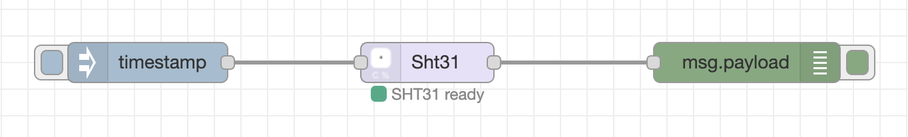

# ESP32 Reset Circuit

This repository contains a collection of scripts, tools and other documentations for the ESP32-based reset watchdog by [AR4 GmbH](https://www.ar4.io).


Features at a glance:
- 5-12V input voltage
- ESP32 programmable interface with onboard UART2Serial converter with USB-C connector
- 3 programmable buttons
- 2 pull-down outputs, 2 pull-up outputs
- 2 input pins
- isolated circuit with Sensirion SHT31 temperature and humidity sensor

---
## Purpose

The main purpose of this board to act as a smart, programmable watchdog. It is meant to be programmed by developers or other experienced persons to overcome certain weird lockup problems for boards. We do not intend to supply a configurable user interface nor firmware for the regular consumer. Because every embedded board might have different requirements for proper reset or power-up, we rather provide the solution for the RockPro64 here as a blueprint.

---
## Temperature Sensor

The temperature sensor is isolated from the rest of the board to enable driving it from an external board with GPIO (e.g. RPi, OrangePi, RockPro64). This was designed in that way, because the ESP32 controlled board is not meant to watch the temperature or humidity, it should be a watchdog.

The sensor is a [Sensirion SHT31 sensor](https://www.sensirion.com/en/environmental-sensors/humidity-sensors/digital-humidity-sensors-for-various-applications/) which is accessed and controlled over I2C. Proper libraries can be found e.g. for the [Adafruit](https://github.com/adafruit/Adafruit_SHT31) implementation.

*Note: It is still possible to use the entire ESP32 circuit NOT as a watchdog, but rather as a Node-MCU with integrated temperature sensor. In order to make this possible, some resistors (R22-R24) need to be populated with 0 Ohm (or just shortcutted). This wires the SHT31 straight to the I2C bus on the ESP32.*

### Simple Python Script

If the temperature sensor is properly wired to the GPIO of the respective board, a simple python script largely taken from [here](http://www.pibits.net/code/raspberry-pi-sht31-sensor-example.php) can be used to query the temperature and humidity.

```python
import smbus
import time

# Get I2C bus
bus = smbus.SMBus(4)

# SHT31 address, 0x44(68)
bus.write_i2c_block_data(0x44, 0x2C, [0x06])

time.sleep(0.5)

# SHT31 address, 0x44(68)
# Read data back from 0x00(00), 6 bytes
# Temp MSB, Temp LSB, Temp CRC, Humididty MSB, Humidity LSB, Humidity CRC
data = bus.read_i2c_block_data(0x44, 0x00, 6)

# Convert the data
temp = data[0] * 256 + data[1]
cTemp = -45 + (175 * temp / 65535.0)
fTemp = -49 + (315 * temp / 65535.0)
humidity = 100 * (data[3] * 256 + data[4]) / 65535.0

# Output data to screen
print "Temperature in Celsius is : %.2f C" %cTemp
print "Temperature in Fahrenheit is : %.2f F" %fTemp
print "Relative Humidity is : %.2f %%RH" %humidity
```

Running the script should give something like:

```
root@vz:~# python sht31.py
Temperature in Celsius is : 29.28 C
Temperature in Fahrenheit is : 84.70 F
Relative Humidity is : 14.55 %RH
```

*Note: I2C bus 4 was used on the RockPro64 connecting Pins 27 and 28 as SDA and SCL.*

### Node-Red Integration

In order to use the temperature sensor in an easy way together with Node-Red, there is an implementation for a Node in the [node-red-contrib-sht31](https://flows.nodered.org/node/node-red-contrib-sht31) package. The only requirement for configuration is to check for the correct I2C bus (and access rights).



The output of a query is a simple object containing temperature and humidity.


---
## Wiring

For wiring for example the RockPro64 correctly, the following setup is applied:


In more detail, the wiring in our case is:

| GPIO (RockPro64) | Cable Color   | ESP32 Resetter       |
| ---------------  |:-------------:| --------------------:|
| Pin 1            | brown         | VCC (SHT31)          |
| Pin 8            | grey          | Heartbeat (J4)       |
| Pin 9            | white         | GND (SHT31)          |
| Pin 27           | violet        | SDA (SHT31)          |
| Pin 28           | white         | SCL (SHT31)          |

While the color coding is not really optimal, it's a direct result of choosing a 40-pin ribbon cable from [Bewinner](https://www.amazon.de/gp/product/B07P4LFM14/ref=ppx_yo_dt_b_asin_title_o07_s00?ie=UTF8&psc=1) and cutting out the relevant cables.

For the Reset and Power button to turn on/off or reset the RockPro64, we connect the following pins (note that on the RockPro64 these pins have to be assembled manually):

| RockPro64      | Cable Color   | ESP32 Resetter       |
| -------------- |:-------------:| --------------------:|
| Power          | blue          | PullDown (J2)        |
| Reset          | orange        | PullDown (J3)        |

**Warning! Don't connect those cables BEFORE flashing the ESP32 firmware. Because the ESP32 is pulling those pins down at boot time, your RockPro64 (or whatever) might not boot. ESP32 firmware needs to pull them up on startup in firmware (see below)!**

---
## Heatbeat over GPIO

Obviously there are multiple different ways to interface the GPIO of a RockPro64 or RPi. We are using a Linux service driving a python script for that.

### Using Python on RockPro64

We are using ```python``` and the [GPIO library](https://github.com/ThroneVault/Rock64-R64.GPIO/) together with an according script to output a heartbeat on a particular GPIO with a 1 second interval. The according file ```heartbeat.py``` looks somewhat like this:

```python
#!/usr/bin/env python

# Clemens Arth, 2021, LGPLv3 License
# based on...
# Frank Mankel, 2018, LGPLv3 License
# Rock 64 GPIO Library for Python
# Thanks Allison! Thanks smartdave!

import R64.GPIO as GPIO
from time import sleep

print("Output Test R64.GPIO Module...")

# Set Variables -> in this case we are at pin 8, aka GPIO #148
var_gpio_out = 148

# GPIO Setup
GPIO.setwarnings(True)
GPIO.setmode(GPIO.ROCK)
GPIO.setup(var_gpio_out, GPIO.OUT, initial=GPIO.HIGH)       # Set up GPIO as an output, with an initial state of HIGH

# Test Output
print("")
print("Testing GPIO Input/Output:")

while True:
        var_gpio_state = GPIO.input(var_gpio_out)       # Return State of GPIO
        print("Output State: " + str(var_gpio_state))
        if var_gpio_state == 1:
                GPIO.output(var_gpio_out,0)                         # Set GPIO to LOW
                print("Turning off")              # Print results
        else:
                GPIO.output(var_gpio_out,1)                         # Set GPIO to LOW
                print("Turning on")
        sleep(1.0)
exit()
```

This sample is largely taken from [Frank Mankel's homepage](https://forum.frank-mankel.org/topic/292/rockpro64-rp64-gpio/6). The pinout configuration is like this for RockPro64:


### Service File

The easiest way to get the heartbeat working is to install a file for ```systemd```. Here is an example script ```heartbeat.service``` that should go into ```/etc/systemd/system```:

```
[Unit]
Description=HeartBeatService
After=network.target

[Service]
Environment=PYTHONUNBUFFERED=1
ExecStart=/usr/bin/python3 /home/<user>/heartbeat.py
ExecReload=/bin/kill -HUP $MAINPID
KillMode=process
Restart=always

[Install]
WantedBy=multi-user.target
```

Naturally, you can start the script from hand by using something like ```systemctl start heartbeat```. If you want to start it at every boot, you have to enable the service accordingly using ```systemctl enable heartbeat```.

---
### ESP32 Firmware

Todo... inverted logic!


```C
#include <Arduino.h>

#define BUTTONPIN 5
#define HEARTBEAT 16
#define ROCKRESET 14
#define POWERKEY 13

bool in = false;
void IRAM_ATTR HandleButtonInterrupt() {
    Serial.println("Interrupt from Button!");
    if(!in)
    {
      // set 100ms reset...
      in = true;
      digitalWrite(ROCKRESET, HIGH);
      delay(100);
      digitalWrite(ROCKRESET, LOW);
    }
    in = false;
}

void setup() {
  Serial.begin(115200);
  // attach an interrupt to the middle button for fun...
  attachInterrupt(BUTTONPIN, HandleButtonInterrupt, FALLING);

  // define input heartbeat pin...
  pinMode(HEARTBEAT, INPUT);

  // define pulldowns to be down by default
  pinMode(ROCKRESET, OUTPUT);
  pinMode(POWERKEY, OUTPUT);
  digitalWrite(ROCKRESET, LOW);
  digitalWrite(POWERKEY, LOW);
}

void loop() {
  // put your main code here, to run repeatedly:
  while(true) {
    int val = digitalRead(HEARTBEAT);
    Serial.printf("Value is %d\n",val);
    delay(500);
  }
}
```
