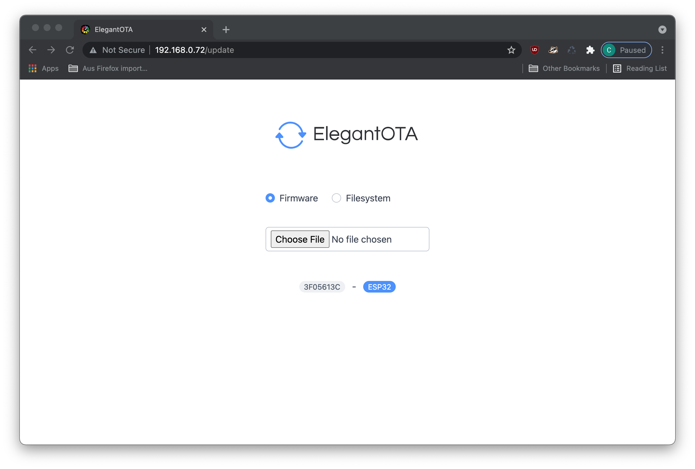
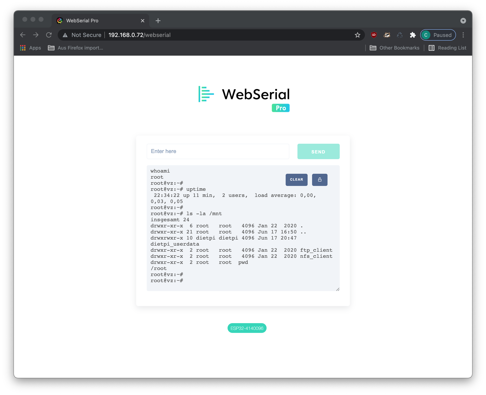

# ESP32 Reset Circuit

This repository contains a collection of scripts, tools and other documentations for the ESP32-based reset watchdog by [AR4 GmbH](https://www.ar4.io).


Features at a glance:
- 7V - 36V input voltage
- ESP32 programmable interface with onboard UART2Serial converter with USB-C connector
- 3 programmable buttons
- 2 pull-down outputs, 2 pull-up outputs
- 2 input pins
- isolated circuit with Sensirion SHT31 temperature and humidity sensor

---
## Purpose

The main purpose of this board to act as a smart, programmable watchdog. It is meant to be programmed by developers or other experienced persons to overcome certain weird lockup problems for boards. We do not intend to supply a configurable user interface nor firmware for the regular consumer. Because every embedded board might have different requirements for proper reset or power-up, we rather provide the solution for the RockPro64 here as a blueprint.

---
## Temperature Sensor

The temperature sensor is isolated from the rest of the board to enable driving it from an external board with GPIO (e.g. RPi, OrangePi, RockPro64). This was designed in that way, because the ESP32 controlled board is not meant to watch the temperature or humidity, it should be a watchdog.

The sensor is a [Sensirion SHT31 sensor](https://www.sensirion.com/en/environmental-sensors/humidity-sensors/digital-humidity-sensors-for-various-applications/) which is accessed and controlled over I2C. Proper libraries can be found e.g. for the [Adafruit](https://github.com/adafruit/Adafruit_SHT31) implementation.

*Note: It is still possible to use the entire ESP32 circuit NOT as a watchdog, but rather as a Node-MCU with integrated temperature sensor. In order to make this possible, some resistors (R22-R24) need to be populated with 0 Ohm (or just shortcutted). This wires the SHT31 straight to the I2C bus on the ESP32.*

| GPIO (ESP32) | SHT31       |
| -------------|:-----------:|
| GPIO21 (SDA) | SDA         |
| GPIO22 (SCL) | SCL         |
| 3.3V   (VCC) | VCC         |

### Simple Python Script

If the temperature sensor is properly wired to the GPIO of the respective board, a simple python script largely taken from [here](http://www.pibits.net/code/raspberry-pi-sht31-sensor-example.php) can be used to query the temperature and humidity.

```python
import smbus
import time

# Get I2C bus
bus = smbus.SMBus(4)

# SHT31 address, 0x44(68)
bus.write_i2c_block_data(0x44, 0x2C, [0x06])

time.sleep(0.5)

# SHT31 address, 0x44(68)
# Read data back from 0x00(00), 6 bytes
# Temp MSB, Temp LSB, Temp CRC, Humididty MSB, Humidity LSB, Humidity CRC
data = bus.read_i2c_block_data(0x44, 0x00, 6)

# Convert the data
temp = data[0] * 256 + data[1]
cTemp = -45 + (175 * temp / 65535.0)
fTemp = -49 + (315 * temp / 65535.0)
humidity = 100 * (data[3] * 256 + data[4]) / 65535.0

# Output data to screen
print "Temperature in Celsius is : %.2f C" %cTemp
print "Temperature in Fahrenheit is : %.2f F" %fTemp
print "Relative Humidity is : %.2f %%RH" %humidity
```

Running the script should give something like:

```
root@vz:~# python sht31.py
Temperature in Celsius is : 29.28 C
Temperature in Fahrenheit is : 84.70 F
Relative Humidity is : 14.55 %RH
```

*Note: I2C bus 4 was used on the RockPro64 connecting Pins 27 and 28 as SDA and SCL.*

### Node-Red Integration

In order to use the temperature sensor in an easy way together with Node-Red, there is an implementation for a Node in the [node-red-contrib-sht31](https://flows.nodered.org/node/node-red-contrib-sht31) package. The only requirement for configuration is to check for the correct I2C bus (and access rights).


The output of a query is a simple object containing temperature and humidity.


---
## Wiring

For wiring for example the RockPro64 correctly, the following setup is applied:


In more detail, the wiring in our case is (alternatives in brackets):

| GPIO (RockPro64) | Cable Color         | ESP32 Resetter                 |
| ---------------  |:-------------------:| :-----------------------------:|
| Pin 17 (Pin 1)   | violet (brown)      | VCC (SHT31)                    |
| Pin 16           | blue                | Heartbeat (J4 - GPIO16)        |
| Pin 8            | grey                | Power Status (J7 - GPIO17)     |
| Pin 20 (Pin 9)   | black (white)       | GND (SHT31)                    |
| Pin 27           | violet              | SDA (SHT31)                    |
| Pin 28           | white               | SCL (SHT31)                    |

While the color coding is not really optimal, it's a direct result of choosing a 40-pin ribbon cable from [Bewinner](https://www.amazon.de/gp/product/B07P4LFM14/ref=ppx_yo_dt_b_asin_title_o07_s00?ie=UTF8&psc=1) and cutting out the relevant cables.

For the Reset and Power button to turn on/off or reset the RockPro64, we connect the following pins (note that on the RockPro64 these pins have to be assembled manually):

| RockPro64      | Cable Color   | ESP32 Resetter              |
| -------------- |:-------------:| :--------------------------:|
| Power          | blue          | PullDown (J3 - GPIO13)        |
| Reset          | orange        | PullDown (J2 - GPIO14)        |

**Warning! Don't connect those cables BEFORE flashing the ESP32 firmware. Because the ESP32 is pulling those pins down at boot time, your RockPro64 (or whatever) might not boot. ESP32 firmware needs to pull them up on startup in firmware (see [below](#inverted-logic))!**

---
## Heatbeat over GPIO

Obviously there are multiple different ways to interface the GPIO of a RockPro64 or RPi. We are using a Linux service driving a python script for that.

### Using Python on RockPro64

We are using ```python``` and the [GPIO library](https://github.com/ThroneVault/Rock64-R64.GPIO/) together with an according script to output a heartbeat on a particular GPIO with a 1 second interval. The according file ```heartbeat.py``` looks somewhat like this:

```python
#!/usr/bin/env python

# Clemens Arth, 2021, LGPLv3 License
# based on...
# Frank Mankel, 2018, LGPLv3 License
# Rock 64 GPIO Library for Python
# Thanks Allison! Thanks smartdave!

import R64.GPIO as GPIO
from time import sleep

print("Output Test R64.GPIO Module...")

# Set Variables -> in this case we are at
# pin 16, aka GPIO #36
# alternatively use pin 8, aka GPIO #148, but we use this for detecting power status
var_gpio_out = 36

# GPIO Setup
GPIO.setwarnings(True)
GPIO.setmode(GPIO.ROCK)
GPIO.setup(var_gpio_out, GPIO.OUT, initial=GPIO.HIGH)       # Set up GPIO as an output, with an initial state of HIGH

# Test Output
print("")
print("Testing GPIO Input/Output:")

while True:
        var_gpio_state = GPIO.input(var_gpio_out)       # Return State of GPIO
        print("Output State: " + str(var_gpio_state))
        if var_gpio_state == 1:
                GPIO.output(var_gpio_out,0)                         # Set GPIO to LOW
                print("Turning off")              # Print results
        else:
                GPIO.output(var_gpio_out,1)                         # Set GPIO to LOW
                print("Turning on")
        sleep(1.0)
exit()
```

This sample is largely taken from [Frank Mankel's homepage](https://forum.frank-mankel.org/topic/292/rockpro64-rp64-gpio/6). The pinout configuration is like this for RockPro64:


### Service File

The easiest way to get the heartbeat working is to install a file for ```systemd```. Here is an example script ```heartbeat.service``` that should go into ```/etc/systemd/system```:

```
[Unit]
Description=HeartBeatService
After=network.target

[Service]
Environment=PYTHONUNBUFFERED=1
ExecStart=/usr/bin/python3 /home/<user>/heartbeat.py
ExecReload=/bin/kill -HUP $MAINPID
KillMode=process
Restart=always

[Install]
WantedBy=multi-user.target
```

Naturally, you can start the script from hand by using something like ```systemctl start heartbeat```. If you want to start it at every boot, you have to enable the service accordingly using ```systemctl enable heartbeat```.

---
## ESP32 Firmware

### Programming
For programming the ESP32, you need to press XP3, hold and press XP1 once, releasing XP3. This puts the ESP32 into programming mode. This should show something like

```
ets Jul 29 2019 12:21:46

rst:0x1 (POWERON_RESET),boot:0x7 (DOWNLOAD_BOOT(UART0/UART1/SDIO_REI_REO_V2))
waiting for download
```

### Example Watchdog watch script
The basic firmware does not enable BT or Wifi at all, as this is not needed. Here is a script to watch the heart beat of a device:

```cpp
#include <Arduino.h>

#define BUTTONPIN 5
#define HEARTBEAT 16
#define RESETKEY 14
#define POWERKEY 13

bool in = false;
void IRAM_ATTR HandleButtonInterrupt() {
    Serial.println("Interrupt from Button!");
    if(!in)
    {
      // set 100ms reset...
      in = true;
      digitalWrite(RESETKEY, HIGH);
      delay(100);
      digitalWrite(RESETKEY, LOW);
      delay(400);
    }
    in = false;
}

void setup() {
  Serial.begin(115200);
  // attach an interrupt to the middle button for fun...
  attachInterrupt(BUTTONPIN, HandleButtonInterrupt, FALLING);

  // define input heartbeat pin...
  pinMode(HEARTBEAT, INPUT);

  // define pulldowns to be up by default (inverted logic)
  pinMode(RESETKEY, OUTPUT);
  pinMode(POWERKEY, OUTPUT);
  digitalWrite(RESETKEY, LOW);
  digitalWrite(POWERKEY, LOW);
}

void loop() {
  // put your main code here, to run repeatedly:
  while(true) {
    int val = digitalRead(HEARTBEAT);
    Serial.printf("Value is %d\n",val);
    delay(500);
  }
}
```
The script does only print the current heartbeat status to the serial. The middle button XP2 is programmed to pull the RESETKEY down for about 100ms. Because the interrupt is fired multiple times probably, the guard makes sure that it is only pulled down once within 500ms.

### Watchdog for RockPro64

TODO:
- implement time measurement
- implement heartbeat to reset time based on 0/1 or 1/0 switch
- code properly

```cpp
#include <Arduino.h>

#define BUTTONPIN 5
#define HEARTBEAT 16
#define POWERWATCH 17
#define ROCKRESET 14
#define ROCKPOWER 13
// #define TMPRT 35 // 30

bool in = false;
void IRAM_ATTR HandleButtonInterrupt() {
    Serial.println("Interrupt from Button!");
    if(!in)
    {
      // set 100ms reset...
      in = true;
      digitalWrite(ROCKRESET, HIGH);
      delay(100);
      digitalWrite(ROCKRESET, LOW);
    }
    in = false;
}

void convertMillis(unsigned long milli, unsigned long& hour, unsigned long &minute, unsigned long &second, unsigned long &remainder)
{
  //3600000 milliseconds in an hour
  hour = milli / 3600000;
  milli = milli - 3600000 * hour;
  //60000 milliseconds in a minute
  minute = milli / 60000;
  milli = milli - 60000 * minute;

  //1000 milliseconds in a second
  second = milli / 1000;
  remainder = milli - 1000 * second;
}

void setup() {

  Serial.begin(115200);
  // attach an interrupt to the middle button for fun...
  attachInterrupt(BUTTONPIN, HandleButtonInterrupt, FALLING);

  // define input heartbeat pin...
  pinMode(HEARTBEAT, INPUT);
  pinMode(POWERWATCH, INPUT);

  // define pulldowns to be down by default
  pinMode(ROCKRESET, OUTPUT);
  pinMode(ROCKPOWER, OUTPUT);
  digitalWrite(ROCKRESET, LOW);
  digitalWrite(ROCKPOWER, LOW);

  delay(2000);
}

//====================================================================

int LOCKUP_TIME = 10 * 1000; // time board is allowed to not send heartbeat
int COOLDOWN_TIME = 120 * 1000; // time after action with no further action to be taken
int HEARTBEAT_COUNT = 10;

unsigned long coolDownEnd = COOLDOWN_TIME; // time when cooldown started
bool resetApplied = false; // reset was last action taken
unsigned long lastTimeHeartBeatChanged = 0; // last time value changed
unsigned long lastTimeLoopIteration = 0; // general
int lastHeartBeatValue = 0; // default to off
int heartBeatCounter = 0;

bool coolDownActive(unsigned long currentTime, unsigned long hour, unsigned long minute, unsigned long second, unsigned long remainder)
{
  bool active = currentTime < coolDownEnd;
  if(active) {
    unsigned long seconds2 = (coolDownEnd - currentTime) / 1000;
    Serial.printf("[%02lu:%02lu:%02lu.%03lu] Cooldown active for another %lu seconds\n", hour, minute, second, remainder, seconds2);
  }
  return active;
}

bool readHeartBeat(unsigned long currentTime, unsigned long hour, unsigned long minute, unsigned long second, unsigned long remainder)
{
  int currentPowerStatus = digitalRead(POWERWATCH);
  Serial.printf("[%02lu:%02lu:%02lu.%03lu] Current Power Watch Status: %s\n", hour, minute, second, remainder, currentPowerStatus ? "on" : "off");
  int currentHeartBeatValue = digitalRead(HEARTBEAT);
  // value changed!
  if(currentHeartBeatValue != lastHeartBeatValue)
  {
    lastHeartBeatValue = currentHeartBeatValue;
    lastTimeHeartBeatChanged = currentTime;
    if(heartBeatCounter < HEARTBEAT_COUNT) {
      heartBeatCounter++;
    }
    else if(heartBeatCounter == HEARTBEAT_COUNT) {
      Serial.printf("[%02lu:%02lu:%02lu.%03lu] Resetting cooldown timer!\n", hour, minute, second, remainder);
      coolDownEnd = currentTime;
      heartBeatCounter++;
    }
    return false;
  }
  else // value did not change
  {
    // locked up!
    if(((currentTime > (lastTimeHeartBeatChanged + LOCKUP_TIME)) && !coolDownActive(currentTime, hour, minute, second, remainder)) || !currentPowerStatus)
    {
      delay(500);
      heartBeatCounter = 0;
      return true;
    }
  }
  return false;
}

// sends a reset signal to the RockPro64
void sendReset(unsigned long timePullDown)
{
  digitalWrite(ROCKRESET, HIGH);
  delay(timePullDown);
  digitalWrite(ROCKRESET, LOW);
  delay(200);
}

void sendPower(unsigned long timePullDown)
{
  digitalWrite(ROCKPOWER, HIGH);
  delay(timePullDown);
  digitalWrite(ROCKPOWER, LOW);
  delay(200);
}

void sanityCheck()
{
  unsigned long currentTime = millis();
  // safeguard overflow after 50 days or so...
  if(lastTimeLoopIteration > currentTime)
  {
    lastTimeLoopIteration = currentTime;
    coolDownEnd = currentTime;
    delay(1000);
    return;
  }

  unsigned long hour, minute, second, remainder;
  convertMillis(currentTime, hour, minute, second, remainder);

  // lastHeartBeatValue is the heartbeat
  // it is 0 (and does not change if board is off)
  // it is 1 (and does not change if board is on and locked up)
  // it alternates between 0 and 1 otherwise

  // returns true if board is off or locked up
  if(readHeartBeat(currentTime, hour, minute, second, remainder))
  {
    Serial.printf("[%02lu:%02lu:%02lu.%03lu] Board locked up!\n", hour, minute, second, remainder);
    Serial.printf("[%02lu:%02lu:%02lu.%03lu] Status is %s!\n", hour,
      minute, second, remainder, lastHeartBeatValue > 0 ? "on" : "off");

    Serial.printf("[%02lu:%02lu:%02lu.%03lu] Send power/reset combi!\n", hour, minute, second, remainder);
    sendPower(2000);
    delay(1000);
    sendReset(2000);

    // sets back the timer for eval against RESET_TIME secs
    lastTimeHeartBeatChanged = currentTime;
    // cooldown should start now!
    coolDownEnd = currentTime + COOLDOWN_TIME;
  }
  else
  {
    // board is alive, so reset flags
    Serial.printf("[%02lu:%02lu:%02lu.%03lu] Last value: %d - changed %lu ms ago!\n", hour,
      minute, second, remainder, lastHeartBeatValue, currentTime - lastTimeHeartBeatChanged );
  }
}

void loop()
{
  // put your main code here, to run repeatedly:
  sanityCheck();
  delay(750);
}

```

### Inverted Logic

The PullDown pins of the board protect both the ESP32 and the board to drive from high currents. As a side effect, the **logic is inverted**. In code, the PullDown pins must be pulled HIGH for them to pull to GND. In order to pull them up, one has to apply LOW.

---

## Standard ESP config interface

In order to configure standard settings, the ESP32 exposes a standard interface. The configuration can be loaded and saved and will sustain any power loss or restart. The default config values are uploaded along the file system and are listed in `config.json`. To reset the watchdog to its defaults without flashing the filesystem again, the flash button (XP3) for more than 5 seconds (see `Constants.h` file for defined period.)


## OTA Updates

To update the firmware, you can use the OTA feature accessible on The interface is accessible on `http://<IP>/update`.



## WebSerial

The current firmware features a webserial interface piping the input directly to the
onboard serial. The interface is accessible on `http://<IP>/webserial`. In this way it is possible to do rudimentary debugging by accessing the
underlying board.

In order to enable the login console on the underlying board, create a file called `/lib/systemd/system/serial-getty115200@.service` on the board with the following contents:

```
#  SPDX-License-Identifier: LGPL-2.1+
#
#  This file is part of systemd.
#
#  systemd is free software; you can redistribute it and/or modify it
#  under the terms of the GNU Lesser General Public License as published by
#  the Free Software Foundation; either version 2.1 of the License, or
#  (at your option) any later version.

[Unit]
Description=Serial Getty on %I
Documentation=man:agetty(8) man:systemd-getty-generator(8)
Documentation=http://0pointer.de/blog/projects/serial-console.html
BindsTo=dev-%i.device
After=dev-%i.device systemd-user-sessions.service plymouth-quit-wait.service getty-pre.target
After=rc-local.service

# If additional gettys are spawned during boot then we should make
# sure that this is synchronized before getty.target, even though
# getty.target didn't actually pull it in.
Before=getty.target
IgnoreOnIsolate=yes

# IgnoreOnIsolate causes issues with sulogin, if someone isolates
# rescue.target or starts rescue.service from multi-user.target or
# graphical.target.
Conflicts=rescue.service
Before=rescue.service

[Service]
# The '-o' option value tells agetty to replace 'login' arguments with an
# option to preserve environment (-p), followed by '--' for safety, and then
# the entered username.
ExecStartPre=-/bin/stty -F /dev/%I ospeed 115200 ispeed 115200
ExecStart=-/sbin/agetty -o '-p -- \\u' --keep-baud 115200 %I $TERM
Type=idle
Restart=always
UtmpIdentifier=%I
TTYPath=/dev/%I
TTYReset=yes
TTYVHangup=yes
KillMode=process
IgnoreSIGPIPE=no
SendSIGHUP=yes

[Install]
WantedBy=getty.target
```

and enable auto-start of the interface Running

```
systemctl enable serial-getty115200@ttyUSB0.service
```

You should be able to log into the board over the webserial interface.



---
# Notes

## Hardware files
- We will not open-source the hardware files, but you can acquire the watchdog from [AR4 GmbH](https://www.ar4.io). Drop us an [email](mailto:sales@vizar.io).

## Known issues (v1.0)
- Thermoresistor on board is non-functional due to wiring to non-ADC pin (GPIO 18)

## HW Changelog
- v1.0 as of Apr. 9 2021
